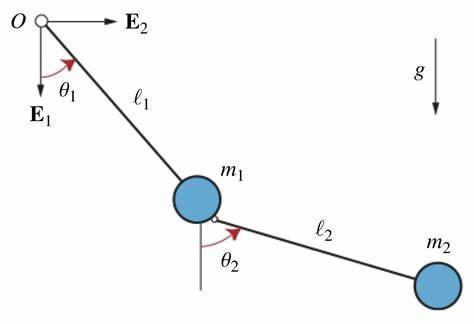

# 🌀 Double Pendulum Chaos Simulator



A Python-based physics simulation of a chaotic double pendulum system with realistic damping effects. This interactive application visualizes complex motion patterns and energy dissipation in a classical mechanics system.

## ✨ Features

- **Realistic Physics Engine**
  - Lagrangian mechanics formulation
  - Adjustable masses for bobs and rods
  - Configurable rod lengths and pivot friction
  - Quadratic air resistance modeling

- **Interactive Visualization**
  - Real-time animation with velocity-colored traces
  - Play/pause/reset controls
  - Parameter sliders for experimentation
  - Default presets for interesting behaviors

- **Advanced Analytics**
  - Angular position/velocity time-series
  - Mechanical energy tracking (KE + PE)
  - Chaos analysis via perturbation studies
  - Phase space visualization

## 🧮 Physics Concepts

- Double pendulum dynamics
- Chaotic systems behavior
- Energy dissipation mechanisms
- Numerical solutions to coupled ODEs
- Sensitivity to initial conditions

## 🛠️ Tech Stack

- **Core**: Python 3.x
- **Numerics**: NumPy, SciPy
- **Symbolics**: SymPy
- **Visualization**: Matplotlib
- **GUI**: Tkinter

## ⚙️ Installation & Usage

```bash
# Clone repository
git clone https://github.com/your-username/double-pendulum-simulator.git
cd double-pendulum-simulator

# Install dependencies
pip install numpy sympy scipy matplotlib

# Run simulation
python double_pendulum.py
